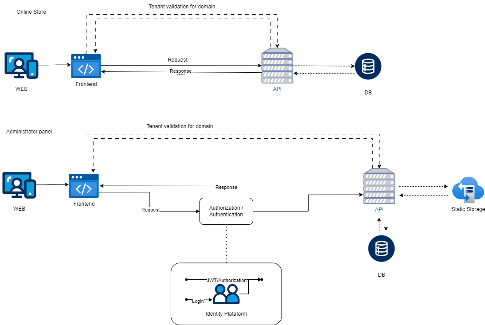

# 🛒 Mercado Gestión

**Mercado Gestión** es una plataforma administrativa modular para la gestión integral de tiendas online y físicas. Diseñada para escalar desde un e-commerce simple hasta una solución de tipo ERP, Mercado Gestión ofrece herramientas para manejar productos, inventario, ventas, compras, usuarios, clientes y mucho más.

> ⚠️ Este proyecto está en desarrollo (versión 2), y se encuentra abierto para revisión técnica y colaboración.

## V1
La primera versión de **Mercado Gestión** fue diseñada para ofrecer una base sólida para la gestión de una tienda online y su administración interna, orientada a modelos multi-tenant.

### ✅ Características implementadas

- **Autenticación y Autorización**
  - Sistema basado en JWT y roles
  - Soporte para múltiples tiendas (`Store`) y negocios (`Business`)
  - Usuarios `superadmin` (acceso global) y `admin` (acceso por tienda)

- **Gestión de productos**
  - ABM de productos con imágenes, descripciones y estados (`isActive`, `hasDiscount`, etc.)
  - Categorías anidadas (categoría, subcategoría, hijo)
  - Selector de categorías jerárquico
  - Soporte para stock (embebido en producto)
  - Editor enriquecido para descripciones (Tiptap)

- **Gestión de usuarios**
  - Listado paginado de usuarios
  - Creación, edición y asignación de roles
  - Gestión de imágenes de perfil

- **Gestión de negocio y tienda**
  - Información del negocio (nombre, dirección, logo, redes sociales)
  - Datos configurables por tenant
  - Editor visual de secciones de la tienda (para el home)

- **Multi-tenant por dominio**
  - Validación por dominio entrante
  - Cada tenant puede tener una configuración y diseño propio

- **Panel administrativo**
  - Panel privado desarrollado en React 19 + Vite
  - Librería de componentes [shadcn/ui](https://ui.shadcn.com/)
  - Formularios reactivos con `react-hook-form` y validación con Zod
  - Interfaz clara, modular y centrada en la experiencia del administrador

### ⚙️ Stack tecnológico

- **Frontend:** React 19, Vite, TailwindCSS, shadcn/ui
- **Formularios:** React Hook Form, Zod
- **Editor de texto:** Tiptap
- **Backend:** ASP.NET 8, C#, Entity Framework, SQL Server
- **Arquitectura:** Hexagonal.
- **Infraestructura:** Docker Compose
- **Autenticación:** Identity (solo para UserManager), JWT tokens
- **Imágenes:** Carga y almacenamiento en base64 (adaptable a CDN o bucket)
- **Almacenamiento** Implementacion de S3 (En este caso usamos una imagen de docker llamada Minio, permite las mismas funcionaldiades que s3 pero es autohosteada)

---

## 🚀 Implementación - Versión 2 (en desarrollo)

La segunda versión de **Mercado Gestión** busca escalar la plataforma modularmente, orientándose a una gestión integral del negocio. Esta versión pone el foco en separar responsabilidades, mejorar la trazabilidad y expandir las funcionalidades hacia modelos de gestión más robustos, como mayoristas o negocios con vendedores.

### 🧱 Nuevos módulos

- **Inventario**  
  - Independiente de los productos  
  - Gestión de stock por lotes: altas, bajas, movimientos  
  - Registro de historial de modificaciones (usuario, fecha, motivo)
  - Filtros por producto, lote, fecha, usuario

- **Ventas y compras**
  - Vistas diferenciadas para administradores y vendedores
  - Registro de ventas y compras por tienda
  - Soporte a ventas minoristas y ventas por mayor
  - Gestión de usuarios con permisos limitados (vendedor)

- **Proveedores**
  - ABM de proveedores con datos de contacto y productos vinculados
  - Historial de compras a cada proveedor

- **Facturación**
  - Generación de comprobantes básicos (presupuesto, ticket, factura)
  - Posibilidad de integración futura con AFIP o sistemas externos

- **Catálogo público**
  - Interfaz pública para mostrar productos sin necesidad de login
  - Posible carrito sin gestión de stock ni pagos en esta etapa

- **Contabilidad**
  - Registro básico de ingresos y egresos
  - Vinculación con ventas, compras y facturación
  - Reportes generales

- **Gestión de clientes**
  - Registro de clientes por venta o de forma manual
  - Historial de compras y facturación
  - (Futuro: posible módulo CRM)

### 🏗️ Objetivo de la V2

> Crear una plataforma extensible y modular de gestión administrativa, orientada a negocios que requieren no solo una tienda online, sino herramientas para organizar su operación interna, ya sea de manera minorista, mayorista o mixta.

---